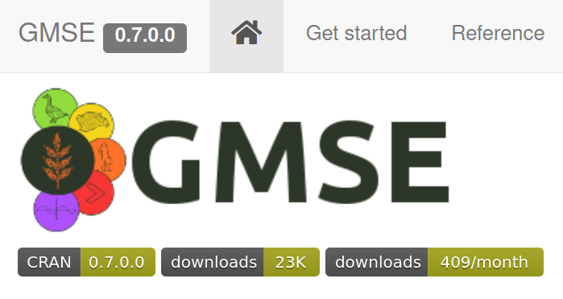

class:title-slide

.center[
## **Models as games**: *"gamesourcing" parameter data & communicating complex models*
]

<br>
<div class="row">
  <div class="column"; style="width: 100%; text-align: center; align: center;">
    
  </div>
  <br>
  
  <div class="column"; style="width: 10%; float: left">
  <br>
  
  </div>
  <div class="column"; style="width: 50%; float: left; align-items:center; justify-content:center;">
    
  </div>
  <div class="column"; style="width: 30%; float: right; text-align: left">
    <b><a href="https://jejoenje.github.io/about/">Jeroen Minderman</a></b><br>
    <a href="mailto:jeroen.minderman2@stir.ac.uk"><i>(jeroen.minderman2@stir.ac.uk)</i></a><br>
  </div>
  <div class="column"; style="width: 10%; float: right; text-align: left; padding-left: 20px; padding-right: 20px">
    <br>
  </div>
  
</div>

---

# Games as models, models as games?

.pull-left[
```{r, fig.retina = 2, echo=FALSE}

```
.font50[
[Len's Island](https://store.steampowered.com/app/1335830/Lens_Island/)
]
- Game "world"
- Players & NPC's
- Player actions
- Game progress
]
.pull-right[
```{r, fig.retina = 2, echo=FALSE}

```
.font50[
[*Nabe-Nielsen et al. 2014*](10.1016/j.ecolmodel.2013.09.025)
]
- Parameters
- Agents
- Inputs
- Outputs (predictions)
]

---
# Modelling resource use in complex systems
```{r, fig.retina = 2, out.width = "90%", fig.align = "center", echo=FALSE}

```
---
# Modelling resource use in complex systems
```{r, fig.retina = 2, out.width = "90%", fig.align = "center", echo=FALSE}

```
---
# Modelling resource use in complex systems
```{r, fig.retina = 2, out.width = "90%", fig.align = "center", echo=FALSE}

```
.font150[
.center[
Model challenges: .red[*communication*] and .red[**parameterisation**]
]
]
---
# GMSE: socio-ecological modelling framework
.center[
.font130[
**Agent-based model of .red[animals] and .red[farmers] on a landscape**
]
]
.left-column75[
```{r, fig.retina = 2, out.width = "75%", fig.align = "center", echo=FALSE}

```
]
.right-column25[
```{r, fig.retina = 2, out.width = "100%", fig.align = "center", echo=FALSE}

```
.font75[
.center[
[confoobio.github.io/gmse/](https://confoobio.github.io/gmse/)  
[Duthie et. al. (2018)](http://doi.wiley.com/10.1111/2041-210X.13091)  
]
]
]

---
# GMSE: socio-ecological modelling framework
.center[
.font130[
**"Decision-making algorithm": .red[Manager] aims to maintain .red[population target]**
]
]
.left-column75[
```{r, fig.retina = 2, out.width = "75%", fig.align = "center", echo=FALSE}

```
]
.right-column25[
```{r, fig.retina = 2, fig.align = "center", echo=FALSE}

```
]
---
# GMSE: socio-ecological modelling framework
.center[
.font130[
**"Decision-making algorithm": .red[Farmers] aim to maximise .red[crop yield]**
]
]
.left-column75[
```{r, fig.retina = 2, out.width = "75%", fig.align = "center", echo=FALSE}

```
]
.right-column25[
```{r, fig.retina = 2, fig.align = "center", echo=FALSE}

```
]
---
# GMSE: socio-ecological modelling framework
.center[
.font130[
**.red[Manager] aims to maintain .red[population target]**  
**.red[Farmers] aim to maximise .red[crop yield]**
]
]
.pull-left[
```{r, fig.retina = 2, out.width = "80%", fig.align = "center", echo=FALSE}

```
]
.pull-right[
```{r, fig.retina = 2, out.width = "70%", fig.align = "center", echo=FALSE}

```
]
.center[
.font130[**Need for algorithm that can .red[balance] objectives**]
]
---
# Animal & Farm: game front-end for GMSE
.font150[**Play here: [https://ochil-ds.co.uk/animalnfarm](https://ochil-ds.co.uk/animalnfarm)**]
.pull-left[
```{r, fig.retina = 2, out.width = "100%", fig.align = "center", echo=FALSE}

```
]
.pull-right[
```{r, fig.retina = 2, out.width = "100%", fig.align = "center", echo=FALSE}

```
- Player actions replace manager model
- Player sets costs for farmer actions
- Free choice to focus on animals, yield, or both

]
---
class: center, middle

.center[
```{r, fig.retina = 2, out.width = "50%", fig.align = "center", echo=FALSE}

```
.font150[**Play here: [https://ochil-ds.co.uk/animalnfarm](https://ochil-ds.co.uk/animalnfarm)**]
]
---
# Animal & Farm: trial play data

## N = 76 play sessions by 28 unique players (1189 decisions)

.center[
```{r, fig.retina = 2, fig.height = 7, fig.width = 13, fig.align = "center", echo=FALSE}
setwd("~/Documents/docs/000_ConFooBio/ModGamesMS")
source("analysis.R")
source("figure5.R")
```
]
---
# Animal & Farm: potential & caveats (1)
.pull-left[
```{r, fig.retina = 2, out.width = "100%", fig.align = "center", echo=FALSE}
knitr::include_graphics("images/anf_interface.jpg")
```
]
.pull-right[
## Potential
- ### "Big data" source for improved decision-making algorithms
  
- ### *In silico* experiments

- ### Education & training

]
---
# Animal & Farm: potential & caveats (2)
.pull-left[
```{r, fig.retina = 2, out.width = "100%", fig.align = "center", echo=FALSE}
knitr::include_graphics("images/anf_interface.jpg")
```
]
.pull-right[
## Caveats
- .font120["The game is..." <br>.font75["..unrealistic!"]<br>.font75["..not very good!"]  ]
]
---
# Animal & Farm: potential & caveats (2)
.pull-left[
```{r, fig.retina = 2, out.width = "100%", fig.align = "center", echo=FALSE}
knitr::include_graphics("https://media.giphy.com/media/3o6Mbsv3wXbIS3dpNS/giphy.gif?cid=ecf05e47dnkbunrg15q0o8yp4z8dphbvqtp4ko0atakh9lgp&rid=giphy.gif&ct=g")
```
]
.pull-right[
## Caveats
- .font120["The game is..." <br>.font75["..unrealistic!"]<br>.font75["..not very good!"]  ]  
  
]

---
# Animal & Farm: potential & caveats (2)
.pull-left[
```{r, fig.retina = 2, out.width = "100%", fig.align = "center", echo=FALSE}
knitr::include_graphics("images/anf_interface.jpg")
```
]
.pull-right[
## Caveats
- .font120["The game is..." <br>.font75["..unrealistic!"]<br>.font75["..not very good!"]]
- Game design needs work!
- Example only; GMSE highly customisable so game can be, too!
- Note above point relates to *model* rather than *game iself*: .font75["*all models are wrong, but some are useful!*"]

]

---
# Animal & Farm: potential & caveats (3)
.pull-left[
```{r, fig.retina = 2, out.width = "100%", fig.align = "center", echo=FALSE}
knitr::include_graphics("images/anf_interface.jpg")
```
]
.pull-right[
## Caveats
- .font120["Humans are biased so your data are biased"]
]

---
# Animal & Farm: potential & caveats (3)
.pull-left[
```{r, fig.retina = 2, out.width = "100%", fig.align = "center", echo=FALSE}
knitr::include_graphics("https://media.giphy.com/media/AhFV18ojkGxwI/giphy.gif?cid=ecf05e47hrko128b13wt0260wscgafc8t7djvnvxmbqdfyfw&rid=giphy.gif&ct=g")
```
]
.pull-right[
## Caveats
- .font120["Humans are biased so your data are biased"]
]
---
# Animal & Farm: potential & caveats (3)
.pull-left[
```{r, fig.retina = 2, out.width = "100%", fig.align = "center", echo=FALSE}
knitr::include_graphics("images/anf_interface.jpg")
```
]
.pull-right[
## Caveats
- .font120["Humans are biased so your data are biased"]  
-  Need for large datasets (lots of plays)  
-  Careful sampling of audience  
-  Decision-making data only relevant to game context presented  
]
---
class: center, middle

```{r, fig.retina = 2, out.width = "30%", fig.align = "center", echo=FALSE}

```

.font150[**Thank you!**]

.center[
*Nils Bunnefeld, Brad Duthie, Isabel Jones, Laura Thomas-Walters, Adrian Bach, Lovisa Nilsson, Jeremy Cusack, Matt Nuttall, Robbie Whytock*  

Many thanks to all the players that have tried A&F so far & those providing valuable feedback!  

Funded by "ConFooBio", EU Horizon 2020 grant agreement no. 679651

]
```{r, fig.retina = 2, out.width = "30%", fig.align = "center", echo=FALSE}

```
